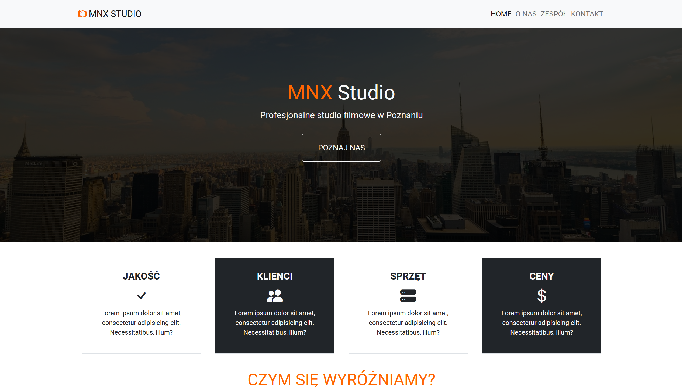
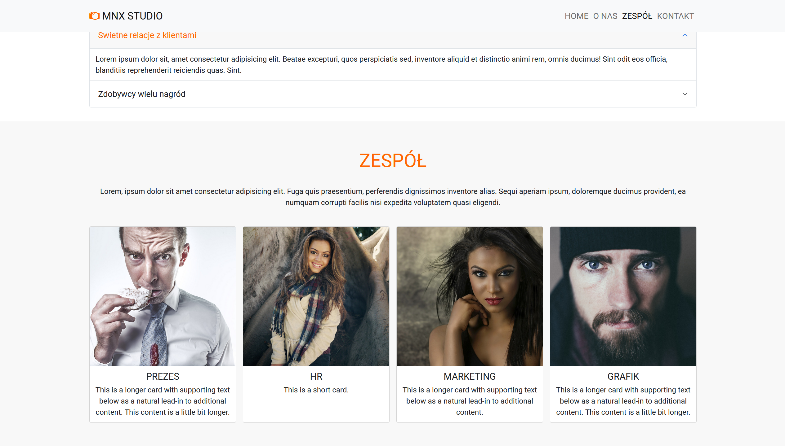
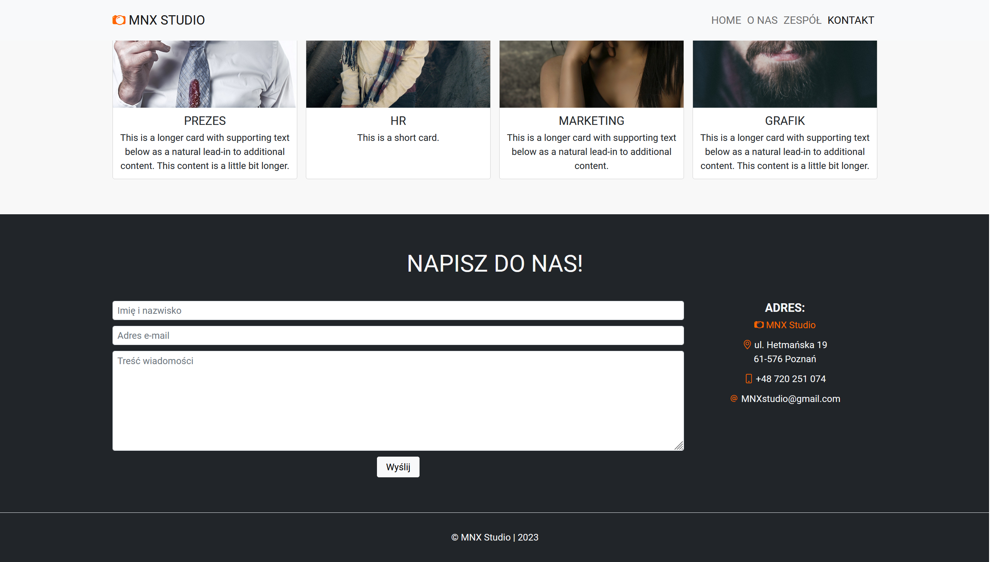

# MNX Studio

## Screenshots

    </img>
     
    </img>
     
    </img>

## Description

- **Mobile first strategy used!**
- Website of a (hypothetical) company called MNX Studio!
- This is very simple website (my first Bootstrap project).
- Website contains a few sections, which are controlled by scroll-spy.

#### Technology used:
- HTML, CSS, JS
- SCSS
- **Framework:** Bootstrap

## What I Learned

- Using most important **SEO tags** in modern websites.
- Mastering my SCSS skills.
- Using Bootstrap and components from Bootstrap Library.
- Creating cards with Bootstrap and style them.

## Author info

- **Name:** Filip Bereszyński
- **Age:** 21 years old
- **Contact:**
    - bereszynski.filip@gmail.com
    - (+48) 510 240 074